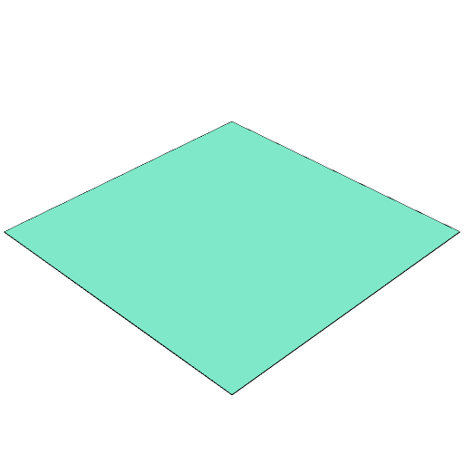
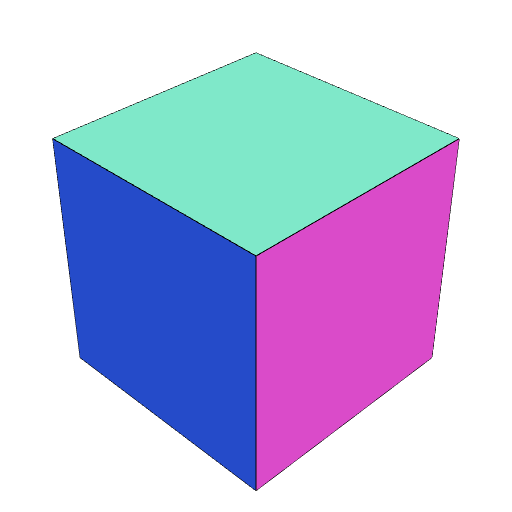

### area()
Parameter|Default|Type
---|---|---
op|value => shape => value|Function to receive the area.

Calls op(value)(shape) with the computed surface area of the shape.

```JavaScript
Box(2)
  .view()
  .area((a) => note(`Box(2).area() gives ${a}`));
```



Box(2).area() gives 4.000000000000002

```JavaScript
Box(2, 2, 2)
  .view()
  .area((a) => note(`Box(2, 2, 2).area() gives ${a}`));
```



Box(2, 2, 2).area() gives 24.000000000000014
