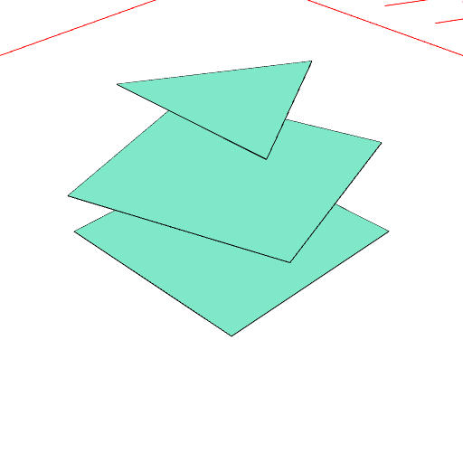

# shape.asPart(id)

Constructs an item as with shape.as(id), but labels it as a part for use with a shape.bom().

See: [as](#https://raw.githubusercontent.com/jsxcad/JSxCAD/master/nb/api/as.nb), [bom](#https://raw.githubusercontent.com/jsxcad/JSxCAD/master/nb/api/bom.nb)

```JavaScript
Box(3)
  .asPart('lid')
  .and(z(1).rz(1 / 5), Triangle(3).z(2).asPart('base'))
  .view()
  .bom();
```



Materials: lid, lid, base
