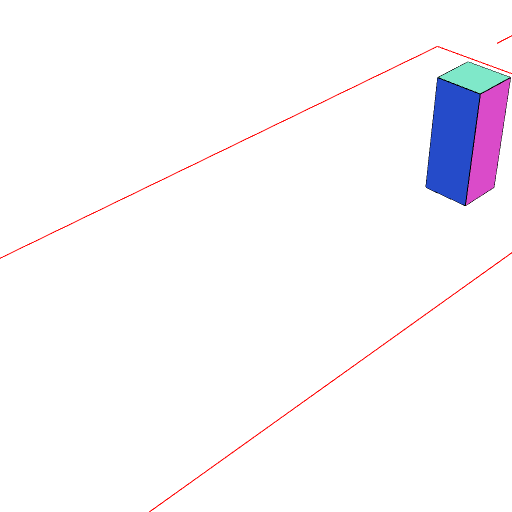
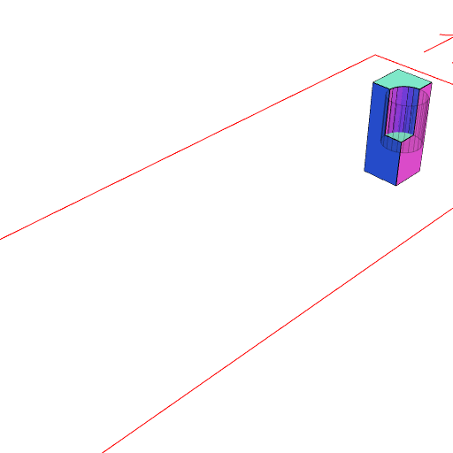

### at()
Parameter|Default|Type
---|---|---
reference|[1, 1, 1]|The reference shape at which to perform the _op_.
...ops||The operations to perform.

Performs each op in sequence on shape in each reference frame.

```JavaScript
Box(2, 2, 5)
  .y(12)
  .view(1)
  .note('Box(2, 2, 5).y(12)')
  .at(XY(), cut(Arc(2, 2, [0, 2.5]).y(-1).x(1)))
  .view(2)
  .note(
    'at(XY(), cut(Arc(2, 2, [0, 2.5]).y(-1).x(1)) cuts the box at the origin by the cylinder.'
  );
```



Box(2, 2, 5).y(12)



at(XY(), cut(Arc(2, 2, [0, 2.5]).y(-1).x(1)) cuts the box at the origin by the cylinder.
