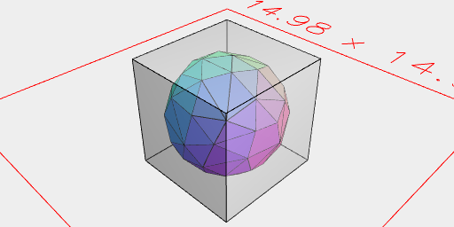
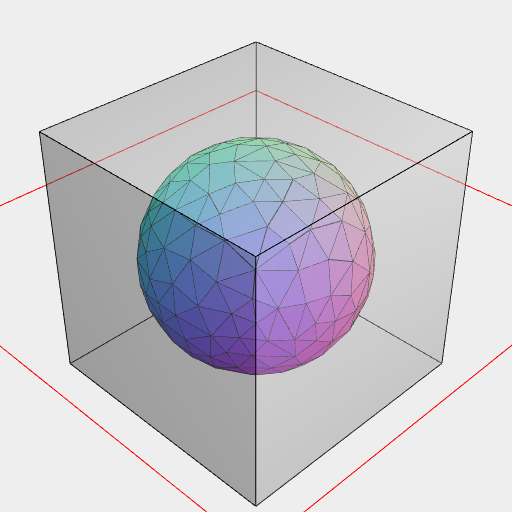

[index](../../nb/api/index.md)
### bb()
Parameter|Default|Type
---|---|---
xMargin|1|Number of mm to add on the x axis.
yMargin|xMargin|Number of mm to add on the x axis.
zMargin|yMargin|Number of mm to add on the x axis.

Produces an axis-aligned bounding box dilated by the specified margin.



A minimal bounding box.

```JavaScript
Orb(5).and(bb(0).material('glass')).view().note('A minimal bounding box.');
```



A bounding box with a margin of 1.

```JavaScript
Orb(5)
  .and(bb(1).material('glass'))
  .view()
  .note('A bounding box with a margin of 1.');
```
