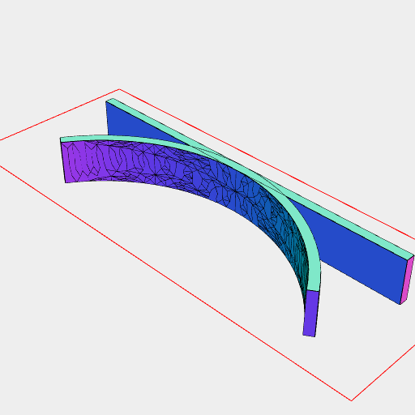
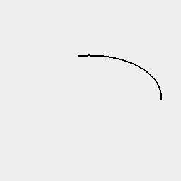
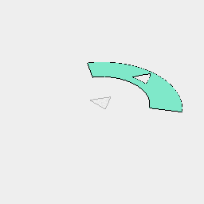
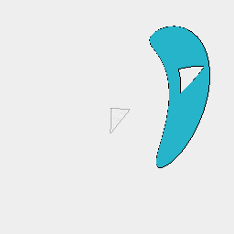
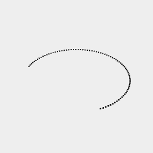

[index](../../nb/api/index.md)
### bend()
Parameter|Default|Type
---|---|---
radius||Number of mm of the radius of the circle to bend around.

Bends a shape onto a circle of the given radius.

The shape needs to have an appropriate meshing density.

See: [remesh](../../nb/api/remesh.md)



Box(40, 1, 5).and(bend(20))

```JavaScript
Box(40, 1, 5)
  .and(bend(20))
  .view()
  .note('Box(40, 1, 5).and(bend(20))');
```



Line(20).bend(10)

```JavaScript
Line(20)
  .bend(10)
  .view()
  .note('Line(20).bend(10)');
```



Box(20, 5).cut(Triangle(4)).bend(10)

```JavaScript
Box(20, 5)
  .cut(Triangle(4))
  .bend(10)
  .view()
  .note('Box(20, 5).cut(Triangle(4)).bend(10)');
```



```JavaScript
Arc(20, 5)
  .cut(Triangle(4))
  .bend(10)
  .view()
  .note('Box(20, 5).cut(Triangle(4)).bend(10)');
```



Point().x({ from: -10, to: 10, by: 1 / 4 }).bend(5)

```JavaScript
Point()
  .x({ from: -10, to: 10, by: 1 / 4 })
  .bend(5)
  .view()
  .note('Point().x({ from: -10, to: 10, by: 1 / 4 }).bend(5)');
```
