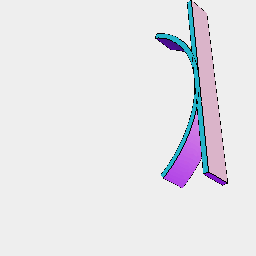

### bend()
Parameter|Default|Type
---|---|---
radius||Number of mm of the radius of the circle to bend around.

Bends a shape onto a circle of the given radius.

The shape needs to have an appropriate meshing density.

See: [remesh](../../nb/api/remesh.md)

```JavaScript
Box(40, 1, 5)
  .y(20)
  .and(remesh().bend(20))
  .by(align())
  .view()
  .note('Box(40, 1, 5).y(20).and(remesh().bend(20))');
```



Box(40, 1, 5).y(20).and(remesh().bend(20))
