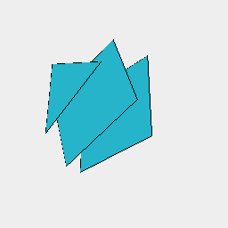

### bom()
Parameter|Default|Type
---|---|---
op|list => note()|Function to receive the bill of materials.

Extracts a Bill of Materials from the parts in shape.

See: [asPart](../../nb/api/asPart.md)

```JavaScript
Box(3)
  .asPart('lid')
  .and(z(1).rz(1 / 5), Triangle(3).z(2).asPart('base'))
  .view()
  .bom((list) =>
    note(
      `Box(3).asPart('lid').and(z(1).rz(1 / 5), Triangle(3).z(2).asPart('base')).bom() produces ${list.join(
        ', '
      )}`
    )
  );
```



Box(3).asPart('lid').and(z(1).rz(1 / 5), Triangle(3).z(2).asPart('base')).bom() produces lid, lid, base
