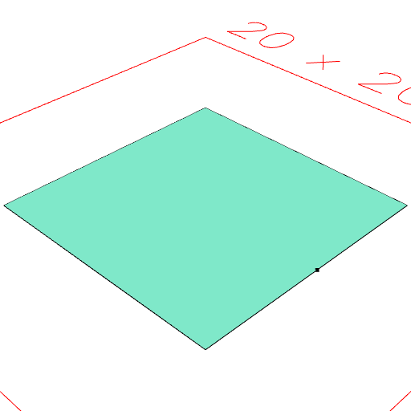
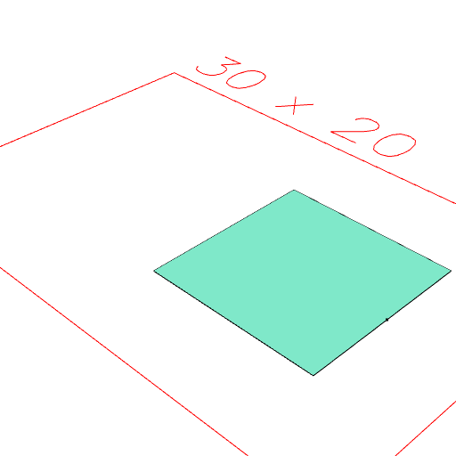

### by()
Parameter|Default|Type
---|---|---
reference||The reference by which to transform shape.

Transforms shape by the provided reference.

```JavaScript
Box(10)
  .and(align('x>'))
  .view(1)
  .note("Box(10).and(align('x>')) produces a box and a reference point")
  .by(align('x>'))
  .view(2)
  .note("by(align('x>')) moves both by the reference.");
```



Box(10).and(align('x>')) produces a box and a reference point



by(align('x>')) moves both by the reference.
