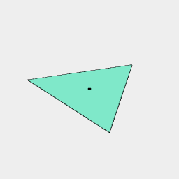
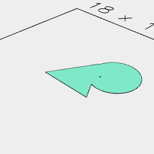
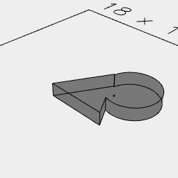

[index](../../nb/api/index.md)
### centroid()
Computes the centroid of shape.



Triangle(5).and(centroid()) shows the centroid in the middle.

```JavaScript
Triangle(5)
  .and(centroid())
  .view()
  .note('Triangle(5).and(centroid()) shows the centroid in the middle.');
```



Triangle(5).join(Arc(4).y(2).x(2)).and(centroid()) shows the centroid move as we change the shape.

```JavaScript
Triangle(5)
  .join(Arc(4).y(2).x(2))
  .and(centroid())
  .view()
  .note(
    'Triangle(5).join(Arc(4).y(2).x(2)).and(centroid()) shows the centroid move as we change the shape.'
  );
```



Triangle(5).join(Arc(4).y(2).x(2)).ez([-1]).and(centroid()) shows the centroid of a volume

```JavaScript
Triangle(5)
  .join(Arc(4).y(2).x(2))
  .ez([-1])
  .and(centroid())
  .material('glass')
  .view()
  .note(
    'Triangle(5).join(Arc(4).y(2).x(2)).ez([-1]).and(centroid()) shows the centroid of a volume'
  );
```
