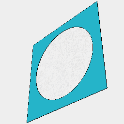
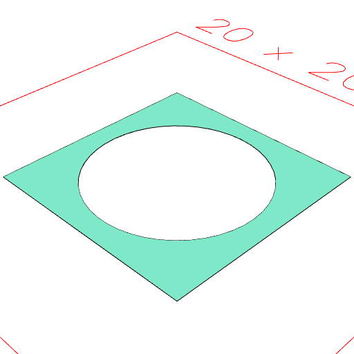
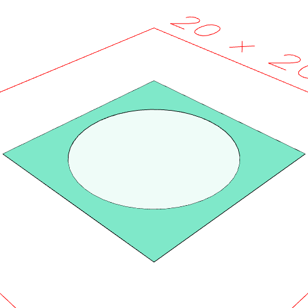

### clean()

Removes ghost geometry, but not voids.

```JavaScript
Box(10)
  .cut(Arc(8))
  .view(1)
  .note('Box(10).cut(Arc(8)) shows the ghost of the cut.')
  .clean()
  .view(2)
  .note('clean() removes the ghost.');
```



Box(10).cut(Arc(8)) shows the ghost of the cut.



clean() removes the ghost.

```JavaScript
Box(10)
  .fitTo(Arc(8).void())
  .view(1)
  .note('Box(10).fitTo(Arc(8).void()) shows the void arc.')
  .clean()
  .view(2)
  .note('clean() shows the void arc remains.');
```



Box(10).fitTo(Arc(8).void()) shows the void arc.


clean() shows the void arc remains.
