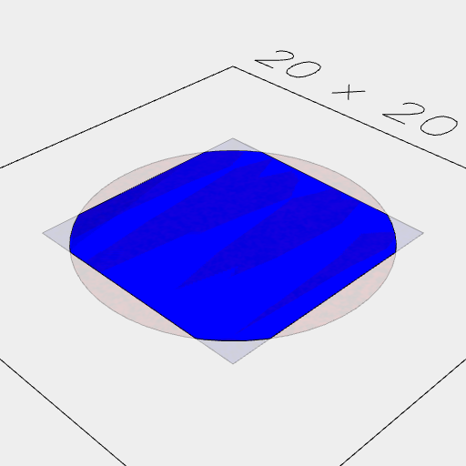
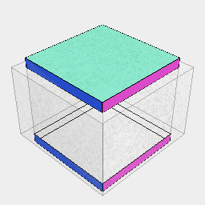
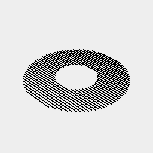

[index](../../nb/api/index.md)
### clip()
Parameter|Default|Type
---|---|---
...others||The shapes to join
'exact'|false|Use exact, but slower, computations
'open'|false|May produce a surface rather than a solid
'noVoid'|false|Does not clip void shapes.

Limits the coverage of shape that covered by all of the other shapes.

See: [clipFrom](../../nb/api/clipFrom.md)



Box(10).color('blue').clip(Arc(12).color('red'))

```JavaScript
Box(10)
  .color('blue')
  .clip(Arc(12).color('red'))
  .view()
  .note("Box(10).color('blue').clip(Arc(12).color('red'))");
```


Box(10).ez([2]).material('copper').clip(Orb(5))

```JavaScript
Box(10)
  .ez([2])
  .material('copper')
  .clip(Orb(5))
  .view()
  .note("Box(10).ez([2]).material('copper').clip(Orb(5))");
```



Box(10, 10, 10).clip(Box(12, 12, 8), 'open')

```JavaScript
Box(10, 10, 10)
  .clip(Box(12, 12, 8), 'open')
  .view()
  .note("Box(10, 10, 10).clip(Box(12, 12, 8), 'open')");
```


Box(10, 10, 10).outline().clip(Line(20))

```JavaScript
Box(10)
  .outline()
  .clip(Line(20))
  .clean()
  .view()
  .note("Box(10, 10, 10).outline().clip(Line(20))");
```



Line(20).y({ from: -12, to: 12, by: 0.25 }).clip(Arc(10).cut(inset(3))).clean()

```JavaScript
Line(20)
  .y({ from: -12, to: 12, by: 0.25 })
  .clip(Arc(10).cut(inset(3)))
  .clean()
  .view()
  .note("Line(20).y({ from: -12, to: 12, by: 0.25 }).clip(Arc(10).cut(inset(3))).clean()");
```
