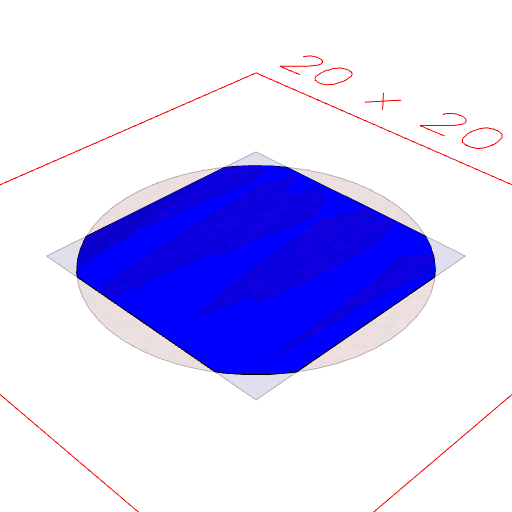
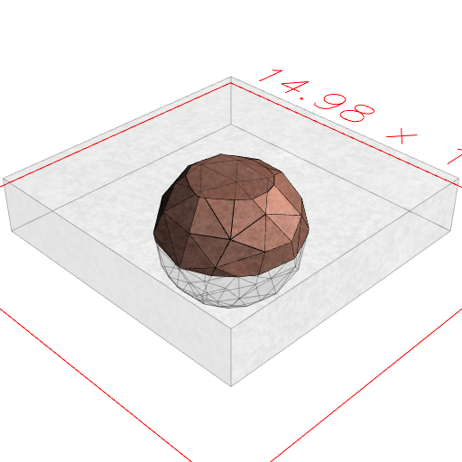
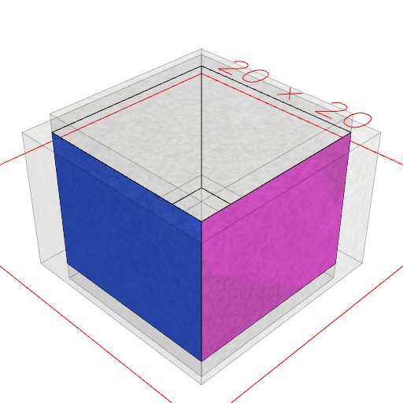

### clip()
Parameter|Default|Type
---|---|---
...others||The shapes to join
'exact'|false|Use exact, but slower, computations
'open'|false|May produce a surface rather than a solid
'noVoid'|false|Does not clip void shapes.

Limits the coverage of shape that covered by all of the other shapes.

See: [clipFrom](../../nb/api/clipFrom.md)

```JavaScript
Box(10)
  .color('blue')
  .clip(Arc(12).color('red'))
  .view()
  .md("Box(10).color('blue').clip(Arc(12).color('red'))");
```



Box(10).color('blue').clip(Arc(12).color('red'))

```JavaScript
Box(10)
  .ez(2)
  .material('copper')
  .clip(Orb(5))
  .view()
  .md("Box(10).ez(2).material('copper').clip(Orb(5))");
```



Box(10).ez(2).material('copper').clip(Orb(5))

```JavaScript
Box(10, 10, 10)
  .clip(Box(12, 12, 8), 'open')
  .view()
  .md("Box(10, 10, 10).clip(Box(12, 12, 8), 'open')");
```



Box(10, 10, 10).clip(Box(12, 12, 8), 'open')
