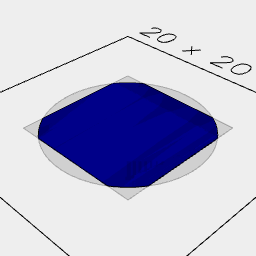

[index](../../nb/api/index.md)
### clipFrom()
Parameter|Default|Type
---|---|---
other||The shape to clip
'exact'|false|Use exact, but slower, computations
'open'|false|May produce a surface rather than a solid
'noVoid'|false|Does not clip void shapes.
Clips other by shape, rather than shape by other.

See: [clip](../../nb/api/clip.md)


Box(10).color('blue').clipFrom(Arc(12).color('red'))

```JavaScript
Box(10)
  .color('blue')
  .clipFrom(Arc(12).color('red'))
  .view()
  .note("Box(10).color('blue').clipFrom(Arc(12).color('red'))");
```



Box(10).color('blue').clip(Arc(12).color('red'))

```JavaScript
Box(10)
  .color('blue')
  .clip(Arc(12).color('red'))
  .view()
  .note("Box(10).color('blue').clip(Arc(12).color('red'))");
```
