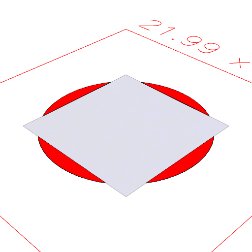
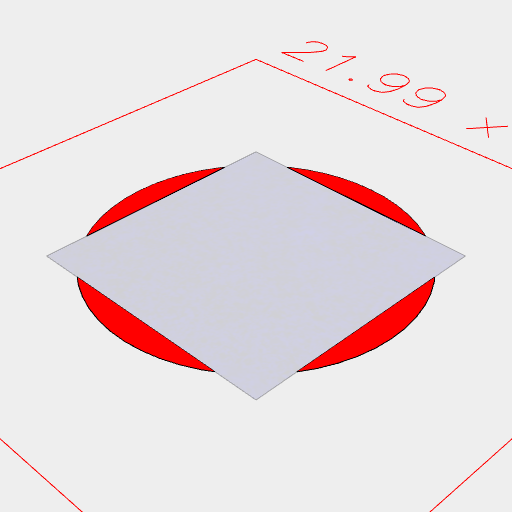

### shape.cutFrom
Parameter|Default|Type
---|---|---
other||Shape
'exact'|false|Mode: use exact geometry
'open'|false|Mode: produces and open surface
'noVoid'|false|Mode: do not cut void geometry

Cuts other by shape, rather than shape by other.

See: [cut](../../nb/api/cut.md)

```JavaScript
Box(10)
  .color('blue')
  .cutFrom(Arc(12).color('red'))
  .view()
  .md("Box(10).color('blue').cutFrom(Arc(12).color('red'))");
```



Box(10).color('blue').cutFrom(Arc(12).color('red'))

```JavaScript
Box(10)
  .color('blue')
  .cut(Arc(12).color('red'))
  .view()
  .md("Box(10).color('blue').cut(Arc(12).color('red'))");
```



Box(10).color('blue').cut(Arc(12).color('red'))
