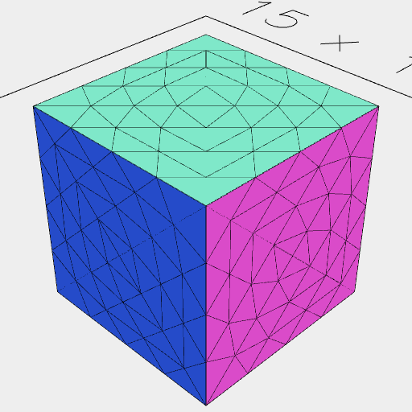
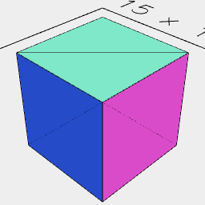

[index](../../nb/api/index.md)
### demesh()

Removes facets that do not contribute to the geometrical shape and which are not required by triangulation.

Demeshing a shape can speed up subsequent operations, but some operations require a densely meshed shape.

See: [remesh](../../nb/api/remesh.md)



Box(5, 5, 5).remesh(1) produces these facets.



Box(5, 5, 5).remesh(1).demesh() produces the required facets.

```JavaScript
Box(5, 5, 5)
  .remesh(1)
  .view(1, 'wireframe')
  .md('Box(5, 5, 5).remesh(1) produces these facets.')
  .demesh()
  .view(2, 'wireframe')
  .md('Box(5, 5, 5).remesh(1).demesh() produces the required facets.');
```
