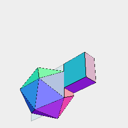
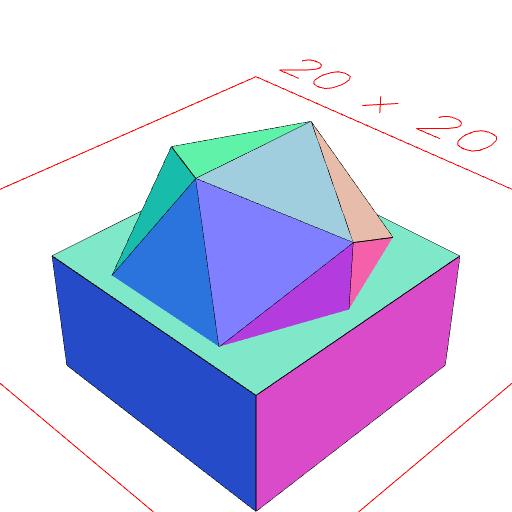
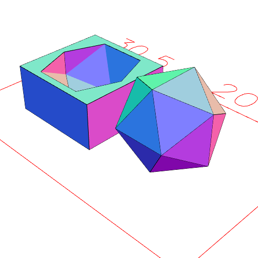

### disjoint()

Attempts to make the leaf geometry of a shape disjoint, so that only one shape covers one region of space.

See: [fit](../../nb/api/fit.nb), [fitTo](#https://raw.githubusercontent.com/jsxcad/JSxCAD/master/nb/api/fitTo.md)

```JavaScript
Box(10, 10, [0, -5])
  .and(Icosahedron(10))
  .view(1)
  .md('Box(10, 10, [0, -5]).and(Icosahedron(10))')
  .view(2, pack())
  .md("Repacking shows the shapes aren't disjoint yet")
  .disjoint()
  .view(3)
  .md('disjoint() leaves the fitted pieces in place.')
  .pack()
  .view(4)
  .md(
    'By repacking the objects we can see how disjoint() has fitted them together.'
  );
```


Box(10, 10, [0, -5]).and(Icosahedron(10))



Repacking shows the shapes aren't disjoint yet



disjoint() leaves the fitted pieces in place.



By repacking the objects we can see how disjoint() has fitted them together.
