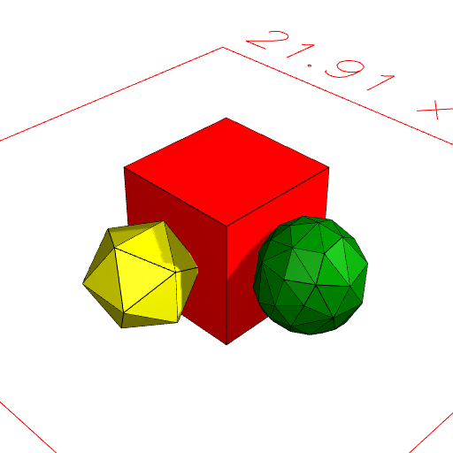
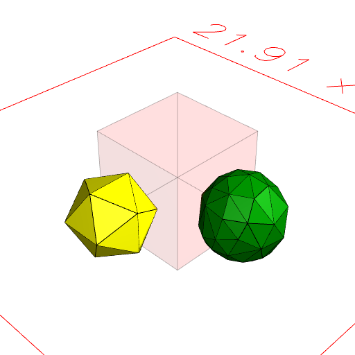
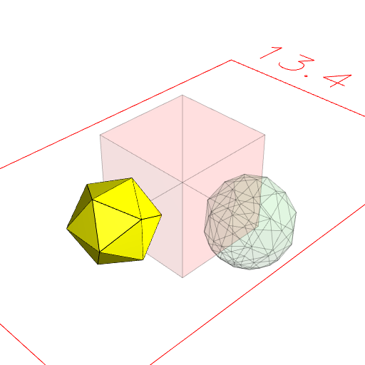

### drop()
Parameter|Default|Type
---|---|---
|selector|self|Shape: the shapes to drop.

Drop removes the selected leaf shapes from shape.

get() and getNot() are common selectors.

See: [get](../../nb/api/get.md)

```JavaScript
Box(5, 5, 5)
  .color('red')
  .and(Orb(4).color('green').x(4), Icosahedron(4).color('yellow').y(-4))
  .view(1)
  .md("Box(5, 5, 5).color('red').and(Orb(4).color('green').x(4))")
  .drop(get('color:red'))
  .view(2)
  .md("drop(get('color:red')) removes the red shapes.")
  .drop(getNot('color:yellow'))
  .view(3)
  .md("drop(getNot('color:yellow')) removes the non-yellow shapes.");
```



Box(5, 5, 5).color('red').and(Orb(4).color('green').x(4))



drop(get('color:red')) removes the red shapes.



drop(getNot('color:yellow')) removes the non-yellow shapes.
