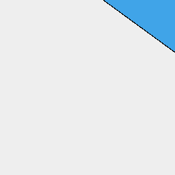

[index](../../nb/api/index.md)
### e()
Parameter|Default|Type
---|---|---
|...extents||List of begin and end extents.

Extrudes the surface along its normal by the extents provided.


See [extrudeAlong](../../nb/api/extrudeAlong.md)



Box(10).rx(1 / 8).e([1, -1], [4, 3]) extrudes along the normal by two extents

```JavaScript
Box(10)
  .rx(1 / 8)
  .e([1, -1], [4, 3])
  .view()
  .note(
    'Box(10).rx(1 / 8).e([1, -1], [4, 3]) extrudes along the normal by two extents'
  );
```
