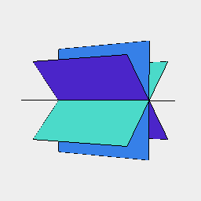
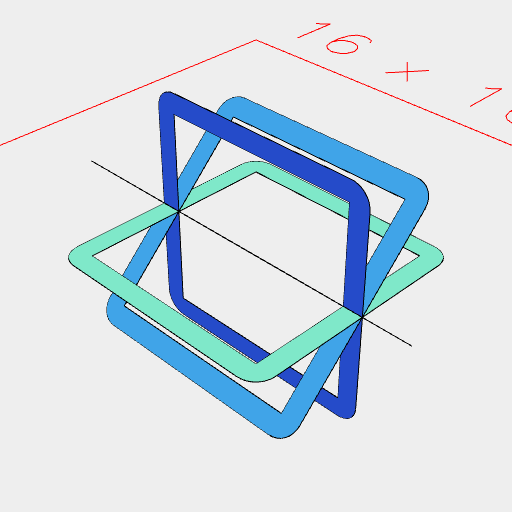

[index](../../nb/api/index.md)
### each()
Parameter|Default|Type
---|---|---
|leafOp|self|Function to transform each leaf.
|groupOp|Group|Function to group the transformed leaves.

Destructures shape into transformed leaves and regroups the result.



Box(5).seq({ by: 1 / 8, upto: 1 }, rx) produces eight sheets



each(offset(0.5).cut(inset(0.5))) has transformed each sheet individually

```JavaScript
Box(5)
  .seq({ by: 1 / 8, upto: 1 }, rx)
  .view(1)
  .note('Box(5).seq({ by: 1 / 8, upto: 1 }, rx) produces eight sheets')
  .each(offset(0.5).cut(inset(0.5)))
  .clean()
  .view(2)
  .note(
    'each(offset(0.5).cut(inset(0.5))) has transformed each sheet individually'
  );
```
