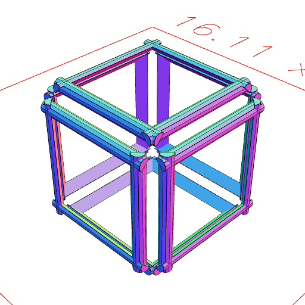
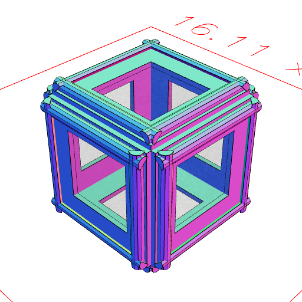

# eachEdge
'''
shape.eachEdge(
    edgeOp = (edge, length) => edge,
    faceOp = (edges, face) => edges,
    groupOp = Group,
    { selections = []});
    
This deals with each edge of a shape as an independently oriented edge.
'''

## See also
[Edge](#https://raw.githubusercontent.com/jsxcad/JSxCAD/master/nb/api/Edge.nb)

## Examples

```JavaScript
Box(5, 5, 5)
  .eachEdge((edge, length) =>
    Arc(0.5, [0.2, 0.7], [length])
      .hasAngle(0 / 4, 2 / 4)
      .to(edge)
  )
  .view();
```



```JavaScript
Box(5, 5, 5)
  .eachEdge(
    (edge, length) =>
      Arc(0.5, [0.2, 0.7], [length])
        .hasAngle(0 / 4, 2 / 4)
        .to(edge),
    (edges, face) => edges.and(face.cut(inset(1)).e(0.2))
  )
  .view();
```


