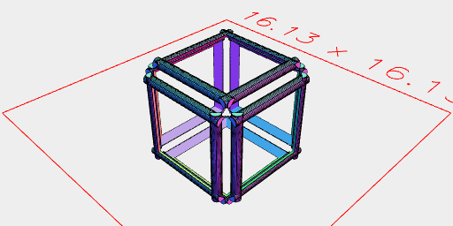
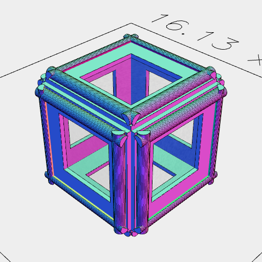
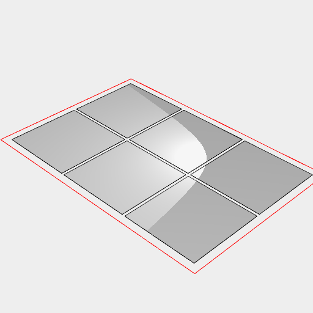

[index](../../nb/api/index.md)
### eachEdge
Parameter|Default|Type
---|---|---
edgeOp|(edge, length, oppositeEdge) => shape => edge|
faceOp|(edges, face) => shape => edges|
groupOp|Group|
...selections||Shapes to delimit edges.

Each edge is independently oriented.

## See also
[Edge](../../nb/api/Edge.md)

```JavaScript
Box(5, 5, 5)
  .eachEdge((edge, length) => s =>
    Arc(0.5, [0.2, 0.7], [length], { end: 2/ 4 })
      .to(edge)
  )
  .view()
  .note(
    'Box(5, 5, 5).eachEdge((edge, length) => s => Arc(0.5, [0.2, 0.7], [length], { end: 2 / 4 }).to(edge))'
  );
```



Box(5, 5, 5).eachEdge((edge, length) => s => Arc(0.5, [0.2, 0.7], [length], { end: 2 / 4 }).to(edge))

```JavaScript
Box(5, 5, 5)
  .eachEdge(
    (edge, length) => s =>
      Arc(0.5, [0.2, 0.7], [length], { end: 2 / 4 })
        .to(edge),
    (edges, face) => s => edges.and(face.cut(inset(1)).e([0.2]))
  )
  .view()
  .note(
    'Box(5, 5, 5).eachEdge((edge, length) => s => Arc(0.5, [0.2, 0.7], [length], { end: 2 / 4 }).to(edge), (edges, face) => s => edges.and(face.cut(inset(1)).e([0.2])))'
  );
```



Box(5, 5, 5).eachEdge((edge, length) => s => Arc(0.5, [0.2, 0.7], [length], { end: 2 / 4 }).to(edge), (edges, face) => s => edges.and(face.cut(inset(1)).e([0.2])))

```JavaScript
Box(50, 50, 50)
  .faces()
  .eachEdge(
    (e, l) => s => e,
    (e, f) => s => f
  )
  .material('glass')
  .each(flat())
  .pack()
  .view();
```


