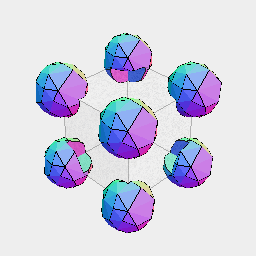

[index](../../nb/api/index.md)
### eachPoint
Parameter|Default|Type
---|---|---
|pointOp|(point, shape) => edge|Function to transform points.
|groupOp|Group|Function to group transformed points.

pointOp may be a shape, in which case it is equivalent to point => pointOp.to(point)

Takes each point shape as an individual reference.



Box(5, 5, 5).cutFrom(eachPoint((p) => s => Orb(3).to(p)))

```JavaScript
Box(5, 5, 5)
  .cutFrom(eachPoint((p) => s => Orb(3).to(p)))
  .view()
  .md('Box(5, 5, 5).cutFrom(eachPoint((p) => s => Orb(3).to(p)))');
```


Box(5, 5, 5).outline().and(eachPoint(Arc(4)))

```JavaScript
Box(5, 5, 5)
  .outline()
  .and(eachPoint(Arc(4)))
  .view()
  .md('Box(5, 5, 5).outline().and(eachPoint(Arc(4)))');
```
