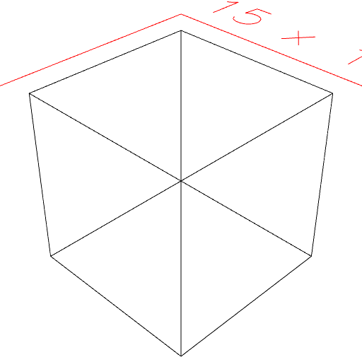
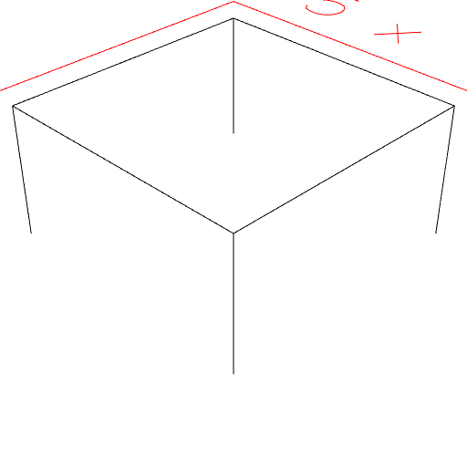

### edges()
Parameter|Default|Type
---|---|---
edgeOp|edges => edges|Function to transform edges.
groupOp|Group|Function to group transformed edges.
{selections}|[]|Limit edges to those contained within a selection.

Extracts edges into a collection of unoriented segments.

See: [eachEdge](../../nb/api/eachEdge.md)

```JavaScript
Box(5, 5, 5).edges().view().md('Box(5, 5, 5).edges()');
```



Box(5, 5, 5).edges()

```JavaScript
Box(5, 5, 5)
  .remesh()
  .edges({ selections: Box(5, 5, [0, 2.5]) })
  .view()
  .md('Box(5, 5, 5).remesh().edges({ selections: Box(5, 5, [0, 2.5]) })');
```



Box(5, 5, 5).remesh().edges({ selections: Box(5, 5, [0, 2.5]) })
