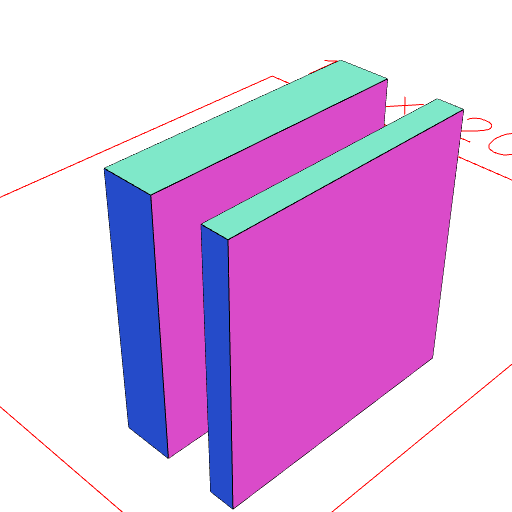

### ex()
Parameter|Default|Type
---|---|---
|...extents||List of begin and end extents.

Extrudes the surface along the x axis by the extents provided.


See [extrudeAlong](../../nb/api/extrudeAlong.nb), [e](#https://raw.githubusercontent.com/jsxcad/JSxCAD/master/nb/api/e.nb), [ey](#https://raw.githubusercontent.com/jsxcad/JSxCAD/master/nb/api/ey.nb), [ez](#https://raw.githubusercontent.com/jsxcad/JSxCAD/master/nb/api/ez.md)

```JavaScript
Box(10)
  .ry(1 / 4)
  .ex(1, -1, 4, 3)
  .view()
  .note(
    'Box(10).ry(1 / 4).ex(1, -1, 4, 3) extrudes along the x axis by two extents'
  );
```



Box(10).ry(1 / 4).ex(1, -1, 4, 3) extrudes along the x axis by two extents
