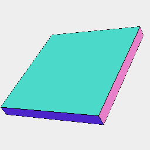
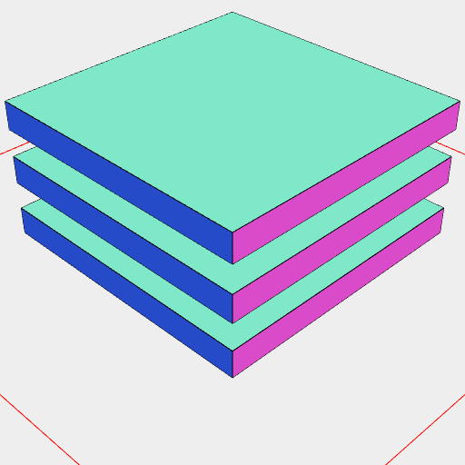
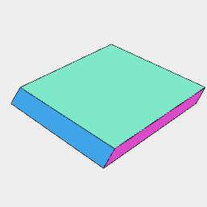
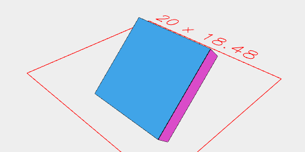
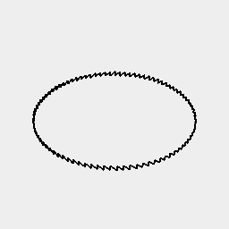
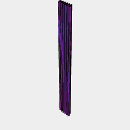
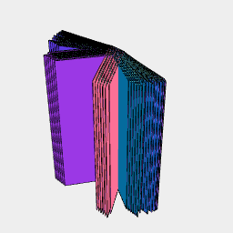
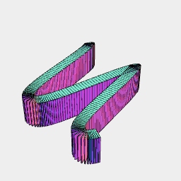

[index](../../nb/api/index.md)
### extrudeAlong()
Parameter|Default|Type
---|---|---
|direction|_required_|Reference shape
|...extents||List of begin and end extents.

Extrudes surfaces, segments, and points by the extents provided.
If the number of extents is odd, 0 will be appended.

The operator [e](../../nb/api/e.md) is supplied as shorthand for extrudeAlong(normal(), ...)

The operator [ex](../../nb/api/ex.md) is supplied as shorthand for extrudeAlong([1, 0, 0], ...)

The operator [ey](../../nb/api/ey.md) is supplied as shorthand for extrudeAlong([0, 1, 0], ...)

The operator [ez](../../nb/api/ez.md) is supplied as shorthand for extrudeAlong([0, 0, 1], ...)

See [e](../../nb/api/e.nb), [ex](#https://raw.githubusercontent.com/jsxcad/JSxCAD/master/nb/api/ex.nb), [ey](#https://raw.githubusercontent.com/jsxcad/JSxCAD/master/nb/api/ey.nb), [ez](#https://raw.githubusercontent.com/jsxcad/JSxCAD/master/nb/api/ez.md)

_Consider renaming extrudeAlong to extrude._



Box(10).extrudeAlong([0, 0, 1], [1])

```JavaScript
Box(10)
  .extrudeAlong([0, 0, 1], [1])
  .view()
  .note('Box(10).extrudeAlong([0, 0, 1], [1])');
```



Box(10).extrudeAlong([0, 0, 1], [5, 4], [3, 2], [1, 0])

```JavaScript
Box(10)
  .extrudeAlong([0, 0, 1], [5, 4], [3, 2], [1, 0])
  .view()
  .note('Box(10).extrudeAlong([0, 0, 1], [5, 4], [3, 2], [1, 0])');
```



Box(10).extrudeAlong(Point(0, 1, 1), [1]) extrudes diagonally

```JavaScript
Box(10)
  .extrudeAlong(Point(0, 1, 1), [1])
  .view()
  .note('Box(10).extrudeAlong(Point(0, 1, 1), [1]) extrudes diagonally');
```



Box(10).rx(1 / 8).extrudeAlong(normal(), [1, -1]) extrudes along the normal

```JavaScript
Box(10)
  .rx(1 / 8)
  .extrudeAlong(normal(), [1, -1])
  .view()
  .note(
    'Box(10).rx(1 / 8).extrudeAlong(normal(), [1, -1]) extrudes along the normal'
  );
```



Arc(32).points().ez(1).loop()

```JavaScript
Arc(32).points().ez(1).loop().view().note(`Arc(32).points().ez(1).loop()`);
```





Wave({ from: -360, to: 360 }, (t) => Point().y(times(100, sin(t * 3 / 360)))).ez(50)

```JavaScript
Wave({ from: -360, to: 360 }, (t) => Point().y(times(100, sin(t * 3 / 360))))
  .ez(50)
  .view()
  .note(`Wave({ from: -360, to: 360 }, (t) => Point().y(times(100, sin(t * 3 / 360)))).ez(50)`);
```



Wave({ from: -100, to: 100 }, (t) => Point().y(times(100, sin(t * 3 / 360))).ez(50).e([20])

```JavaScript
Wave({ from: -100, to: 100 }, (t) => Point().y(times(100, sin(t * 3 / 360))))
  .ez(50)
  .e([20])
  .view()
  .note(`Wave({ from: -100, to: 100 }, (t) => Point().y(times(100, sin(t * 3 / 360))).ez(50).e([20])`);
```
