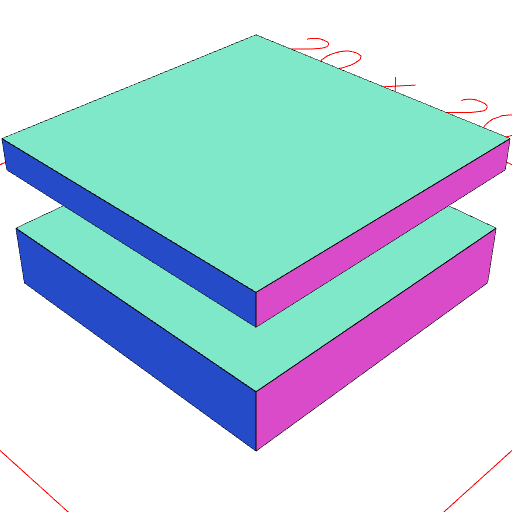

### ez()
Parameter|Default|Type
---|---|---
|...extents||List of begin and end extents.

Extrudes the surface along the z axis by the extents provided.

See [extrudeAlong](../../nb/api/extrudeAlong.nb), [e](#https://raw.githubusercontent.com/jsxcad/JSxCAD/master/nb/api/e.nb), [ex](#https://raw.githubusercontent.com/jsxcad/JSxCAD/master/nb/api/ex.nb), [ey](#https://raw.githubusercontent.com/jsxcad/JSxCAD/master/nb/api/ey.md)

```JavaScript
Box(10)
  .ez(1, -1, 4, 3)
  .view()
  .note(
    'Box(10).rx(1 / 8).ez(1, -1, 4, 3) extrudes along the z axis by two extents'
  );
```



Box(10).rx(1 / 8).ez(1, -1, 4, 3) extrudes along the z axis by two extents
