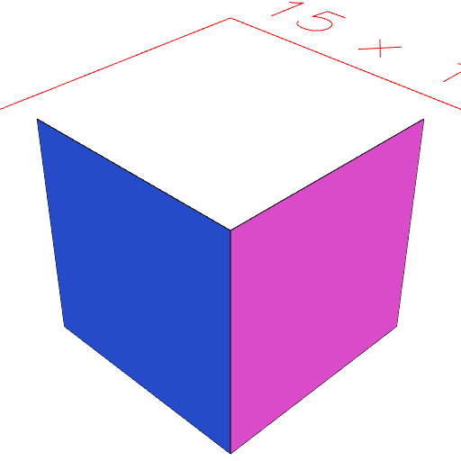
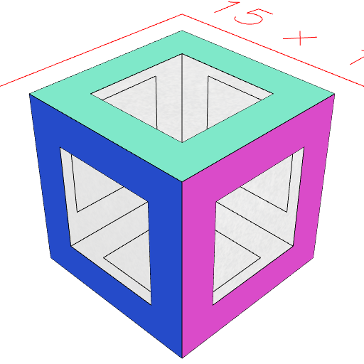
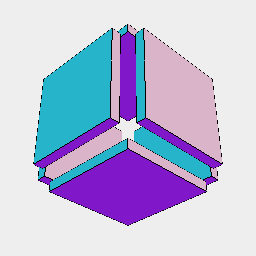

### faces()
Parameter|Default|Type
---|---|---
|faceOp|noop|Transform for each face.
|groupOp|Group|Groups transformed faces.

Produces each facet as a separate surface.

```JavaScript
Box(5, 5, 5)
  .faces()
  .n(5, 2)
  .view()
  .note('Box(5, 5, 5).faces().n(5, 2) selects two faces of the box');
```



Box(5, 5, 5).faces().n(5, 2) selects two faces of the box

```JavaScript
Box(5, 5, 5)
  .faces()
  .each(cut(inset(1)))
  .view()
  .note('Box(5, 5, 5).faces().each(cut(inset(1))) cuts a hole in each face');
```



Box(5, 5, 5).faces().each(cut(inset(1))) cuts a hole in each face

```JavaScript
Box(5, 5, 5)
  .faces()
  .each(e(0.5, 1))
  .view()
  .note('Box(5, 5, 5).faces().each(e(1)) extrudes each face along its normal');
```



Box(5, 5, 5).faces().each(e(1)) extrudes each face along its normal
