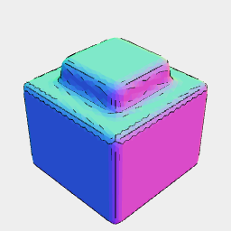

[index](../../nb/api/index.md)
### fair()
Parameter|Default|Type
---|---|---
density|1|How dense a refinement to fair.
{density}|density]|How dense a refinement to fair.

Makes curves within the selected region as smooth as possible.



```JavaScript
Box(10)
  .cut(Triangle(7))
  .ez([20])
  .fair(10, Box(11).ez([15, 21]))
  .view()
  .v(5);
```
