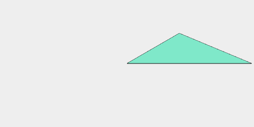
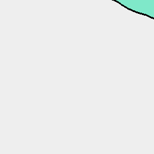
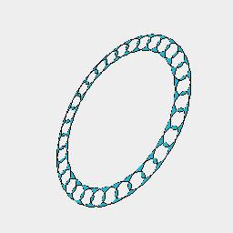

[index](../../nb/api/index.md)
### fill()
'holes'|false|Use an even-odd fill rule to induce holes

Converts the shape to segments and fills them to produce surfaces.

[f](https://raw.githubusercontent.com/jsxcad/JSxCAD/master/nb/api/f.nb) is provided as shorthand.

This follows an odd-even winding rule, allowing holes to be constructed.

See: [f](https://raw.githubusercontent.com/jsxcad/JSxCAD/master/nb/api/f.nb).



Loop(Point(0, 0, 0), Point(0, 1, 0), Point(1, 1, 0)).fill() produces a triangle.

```JavaScript
Loop(Point(0, 0, 0), Point(0, 1, 0), Point(1, 1, 0))
  .fill()
  .view()
  .note(
    'Loop(Point(0, 0, 0), Point(0, 1, 0), Point(1, 1, 0)).fill() produces a triangle.'
  );
```



Arc([4, 5], 2, 0).seq({ by: 1 / 32 }, rz).fill() does not produce a hole.

```JavaScript
Arc([4, 5], 2, 0)
  .seq({ by: 1 / 32 }, rz)
  .fill()
  .view()
  .note(
    'Arc([4, 5], 2, 0).seq({ by: 1 / 32 }, rz).fill() does not produce a hole.'
  );
```



Arc([4, 5], 2, 0).seq({ by: 1 / 32 }, rz).fill('holes') produces a hole

```JavaScript
Arc([4, 5], 2, 0)
  .seq({ by: 1 / 32 }, rz)
  .fill('holes')
  .view()
  .note(
    "Arc([4, 5], 2, 0).seq({ by: 1 / 32 }, rz).fill('holes') produces a hole"
  );
```
