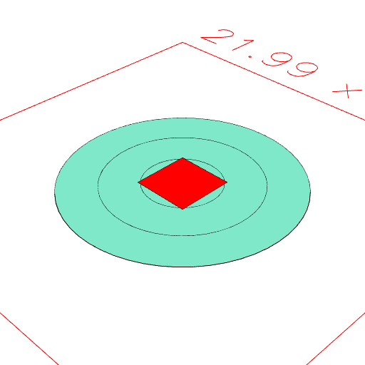
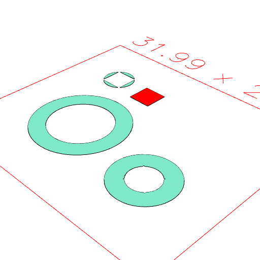

### fit()
Parameter|Default|Type
---|---|---
|...others||The shapes to fit

Assembles the shapes into a disjoint fit.

This is equivalent to Assembly(...others, shape).

See: [Assembly](https://raw.githubusercontent.com/jsxcad/JSxCAD/master/nb/api/Assembly.nb), [disjoint](https://raw.githubusercontent.com/jsxcad/JSxCAD/master/nb/api/disjoint.nb), [fitTo](https://raw.githubusercontent.com/jsxcad/JSxCAD/master/nb/api/fitTo.nb).

```JavaScript
Box(3)
  .color('red')
  .fit(Arc(12), Arc(8), Arc(4))
  .view(1)
  .note("Box(3).color('red').fit(Arc(12), Arc(8), Arc(4)) fitted in place.")
  .pack()
  .view(2)
  .note('Repacked to show the pieces.');
```



Box(3).color('red').fit(Arc(12), Arc(8), Arc(4)) fitted in place.



Repacked to show the pieces.
