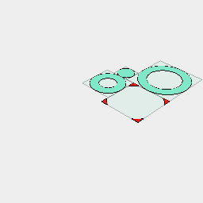

[index](../../nb/api/index.md)
### fitTo()
Parameter|Default|Type
---|---|---
...others||The shapes to fit

Assembles the shapes into a disjoint fit.

This is equivalent to Assembly(shape, ...others).

See: [Assembly](https://raw.githubusercontent.com/jsxcad/JSxCAD/master/nb/api/Assembly.nb), [disjoint](https://raw.githubusercontent.com/jsxcad/JSxCAD/master/nb/api/disjoint.nb), [fit](https://raw.githubusercontent.com/jsxcad/JSxCAD/master/nb/api/fit.nb).


Box(3).fit(Arc(12), Arc(8), Arc(4)) fitted in place



Repacked to show the pieces.

```JavaScript
Box(10)
  .color('red')
  .fitTo(Arc(12), Arc(8), Arc(4))
  .view(1)
  .note('Box(3).fit(Arc(12), Arc(8), Arc(4)) fitted in place')
  .pack()
  .view(2)
  .note('Repacked to show the pieces.');
```
