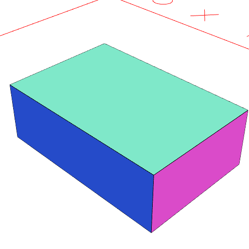
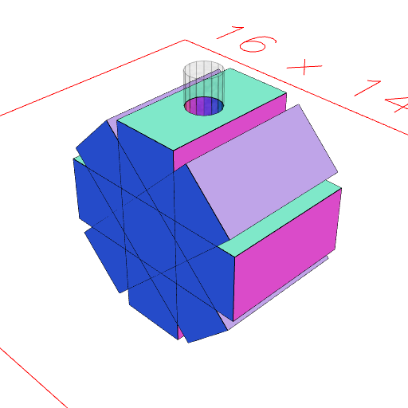

### flat()

Puts the shape into its preferred orientation (which is not necessarily flat).

This is mostly used in preparation for packing for export.

This is equivalent to shape.to(XY()).

See: [to](https://raw.githubusercontent.com/jsxcad/JSxCAD/master/nb/api/to.nb).

```JavaScript
Box(6, 4, 2)
  .view(1)
  .note('Box(6, 4, 2) is our starting shape in its preferred orientation')
  .seq({ by: 1 / 8 }, ry)
  .cut(Arc(1, 1, 8))
  .view(2)
  .note('We arrange the boxes and perform a cut')
  .each(flat())
  .pack()
  .view(3)
  .note(
    'each(flat()).pack() arranges each box separately in its preferred orientation'
  );
```



Box(6, 4, 2) is our starting shape in its preferred orientation



We arrange the boxes and perform a cut


each(flat()).pack() arranges each box separately in its preferred orientation
