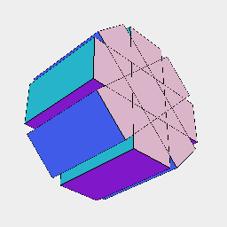
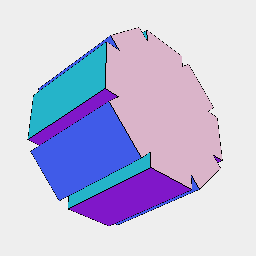

### fuse()

Attempts to joins all of the parts of the shape.

See: [join](https://raw.githubusercontent.com/jsxcad/JSxCAD/master/nb/api/join.nb).

```JavaScript
Box(6, 4, 2)
  .seq({ by: 1 / 8 }, ry)
  .view(1)
  .note('Box(6, 4, 2).seq({ by: 1 / 8 }, ry) arranges boxes in a group')
  .fuse()
  .view(2)
  .note('fuse() turns them into a single solid');
```



Box(6, 4, 2).seq({ by: 1 / 8 }, ry) arranges boxes in a group



fuse() turns them into a single solid
