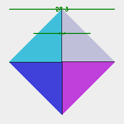
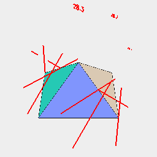

[index](../../nb/api/index.md)
### gauge()
Parameter|Default|Type
---|---|---
...refs||Reference geometry for the gauge positions.
{offset}|5|Offset of the label away from the model.
{length}|0|Length of the gauge needles toward the model.
{color}|'green'|The color to use for the gauge needles.

Generates a set of gauges for measuring width at a particular reference position.



Box(20).z(-5).hull(Point().z(5)).rz(1 / 8).gauge(0, Z({ from: -5, to: 5, by: 5 }))

```JavaScript
Box(20)
  .z(-5)
  .hull(Point().z(5))
  .rz(1 / 8)
  .gauge(0, Z({ from: -5, to: 5, by: 5 }))
  .view('top')
  .note("Box(20).z(-5).hull(Point().z(5)).rz(1 / 8).gauge(0, Z({ from: -5, to: 5, by: 5 }))");
```



Box(20).z(-5).hull(Point().z(5)).rz(1 / 8).gauge(15, 20, RX({ by: 1 / 8, to: 1 / 2 }), 'red')

```JavaScript
Box(20)
  .z(-5)
  .hull(Point().z(5))
  .rz(1 / 8)
  .gauge(15, 20, RX({ by: 1 / 8, to: 1 / 2 }), 'red')
  .view()
  .note(`Box(20).z(-5).hull(Point().z(5)).rz(1 / 8).gauge(15, 20, RX({ by: 1 / 8, to: 1 / 2 }), 'red')`);
```
