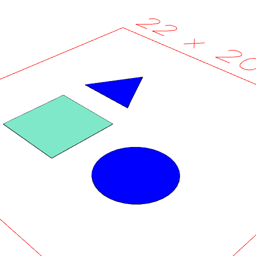
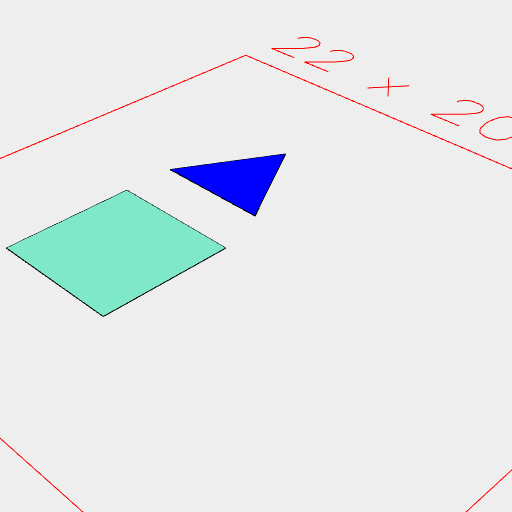

### get()
Parameter|Default|Type
---|---|---
|...tags||Get leafs with these tags.

Extracts the leaf geometry within shape which has any of the specified tags.

Unqualified tags are implicitly 'item' tags.

Does not find leaf geometry within items - use in() to access the interior of an item.

See: [getNot](https://raw.githubusercontent.com/jsxcad/JSxCAD/master/nb/api/getNot.nb), [in](https://raw.githubusercontent.com/jsxcad/JSxCAD/master/nb/api/in.nb).

```JavaScript
const design = Group(
  Box(5).as('box'),
  Arc(5).color('blue'),
  Triangle(5).color('blue').as('triangle')
)
  .pack()
  .in()
  .view(1)
  .note(
    "const design = Group(Box().as('box'), Arc().color('blue'), Triangle().color('blue').as('triangle')).pack().in();"
  );
```



const design = Group(Box().as('box'), Arc().color('blue'), Triangle().color('blue').as('triangle')).pack().in();

```JavaScript
design
  .get('color:blue')
  .view()
  .note("design.get('color:blue') finds the Arc, but not the Triangle.");
```


design.get('color:blue') finds the Arc, but not the Triangle.

```JavaScript
design.get('triangle').view().note("design.get('triangle') finds the triangle");
```



design.get('triangle') finds the triangle

```JavaScript
design
  .get('*')
  .view()
  .note('design.get(' * ') finds all items');
```


