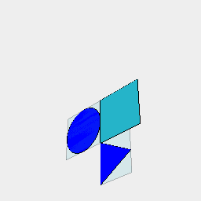
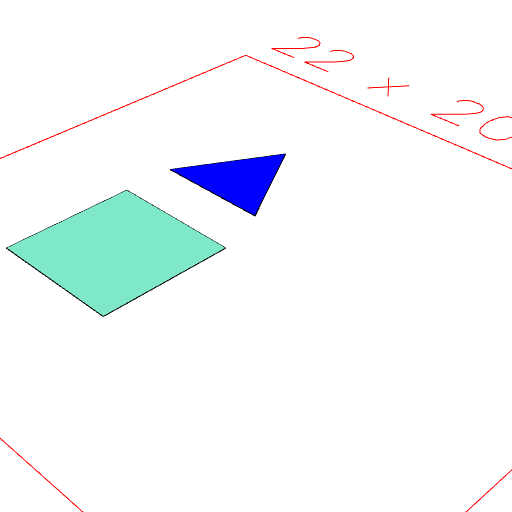
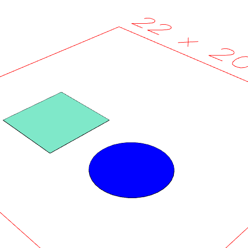
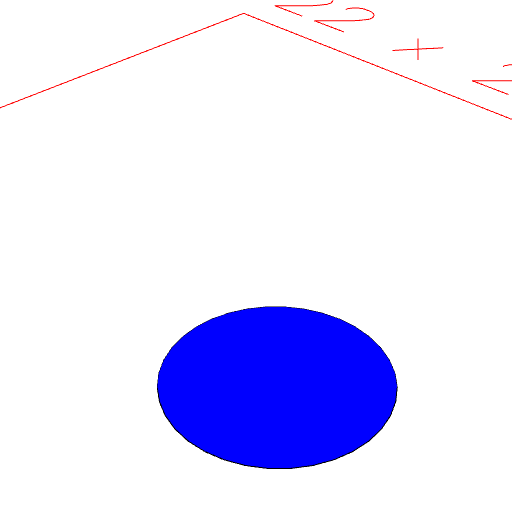

### getNot()
Parameter|Default|Type
---|---|---
|...tags||Get leafs with these tags.

Extracts the leaf geometry within shape which has none of the specified tags.

Unqualified tags are implicitly 'item' tags.

Does not find leaf geometry within items - use in() to access the interior of an item.

See: [get](https://raw.githubusercontent.com/jsxcad/JSxCAD/master/nb/api/getNot.nb), [in](https://raw.githubusercontent.com/jsxcad/JSxCAD/master/nb/api/in.nb).

```JavaScript
const design = Group(
  Box(5).as('box'),
  Arc(5).color('blue'),
  Triangle(5).color('blue').as('triangle')
)
  .pack()
  .in()
  .view(1)
  .note(
    "const design = Group(Box().as('box'), Arc().color('blue'), Triangle().color('blue').as('triangle')).pack().in();"
  );
```



const design = Group(Box().as('box'), Arc().color('blue'), Triangle().color('blue').as('triangle')).pack().in();

```JavaScript
design
  .getNot('color:blue')
  .view()
  .note("design.getNot('color:blue') discards the Arc, but not the Triangle.");
```



design.getNot('color:blue') discards the Arc, but not the Triangle.

```JavaScript
design
  .getNot('triangle')
  .view()
  .note("design.get('triangle') discards the triangle");
```



design.get('triangle') discards the triangle

```JavaScript
design
  .getNot('*')
  .view()
  .note('design.get(' * ') discards all items');
```


