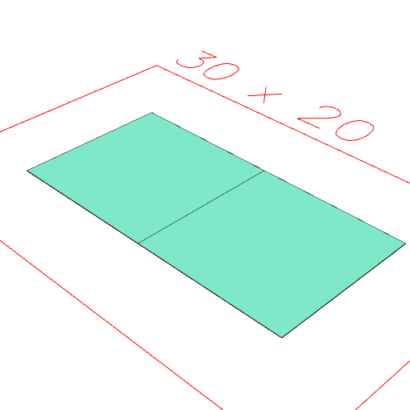
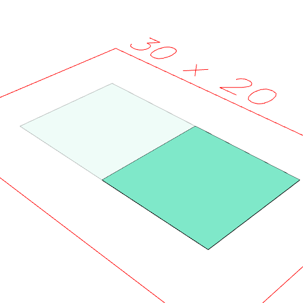

### ghost()
Make a shape into ghost geometry, which is displayed transparently, but does not otherwise interact or produce output.

This is mostly used to show how things related in the past.

Operations like cut and clip will leave ghosts of the shapes that were cut away or clipped against.

```JavaScript
Box(10)
  .op(x(5).as('a'), x(-5).as('b'))
  .view(1)
  .note("Box(10).op(x(5).as('a'), x(-5).as('b')) produces normal geometry.")
  .on(get('b'), ghost())
  .view(2)
  .note("on(get('b'), ghost()) turns one into a ghost.");
```



Box(10).op(x(5).as('a'), x(-5).as('b')) produces normal geometry.



on(get('b'), ghost()) turns one into a ghost.
