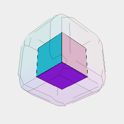
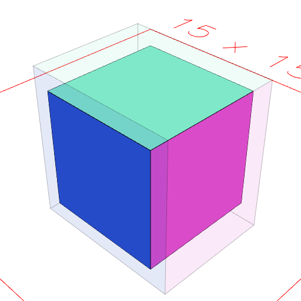
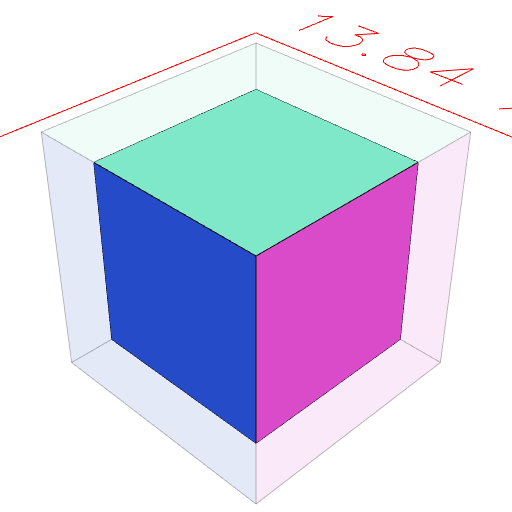
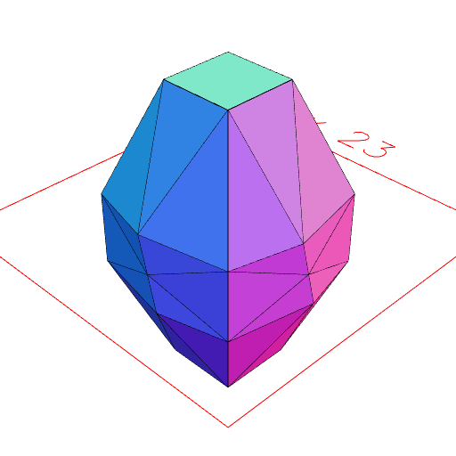

### grow()
Parameter|Default|Type
---|---|---
amount|0|Number of mm to grow by.
axes|'xyz'|String specifiying axis constraints.
...selections||Shapes limiting the growth region.

Expands a solid by amount mm along the axes specified (any combination of 'xyz').

Amount may be negative.

_Note: May produce self-intersection._

```JavaScript
Box(5, 5, 5)
  .and(grow(1).ghost())
  .view()
  .note('The ghost is grown by 5 mm in all directions.');
```



The ghost is grown by 5 mm in all directions.

```JavaScript
Box(5, 5, 5)
  .and(grow(1, 'xz').ghost())
  .view()
  .note('The ghost is grown by 5 mm in only x and z directions.');
```



The ghost is grown by 5 mm in only x and z directions.

```JavaScript
Box(5, 5, 5)
  .op(ghost(), grow(-1))
  .view()
  .note(
    'Box(5, 5, 5).op(ghost(), grow(-1)) shrinks the box by 1 mm, leaving a ghost for reference.'
  );
```



Box(5, 5, 5).op(ghost(), grow(-1)) shrinks the box by 1 mm, leaving a ghost for reference.

```JavaScript
Box(5, 5, 20)
  .grow(4, 'xy', Box(5, 5, 5))
  .view()
  .note(
    "Box(5, 5, 20).grow(4, 'xy', Box(5, 5, 5)) grows the middle of the pillar outward by 5 mm."
  );
```



Box(5, 5, 20).grow(4, 'xy', Box(5, 5, 5)) grows the middle of the pillar outward by 5 mm.
