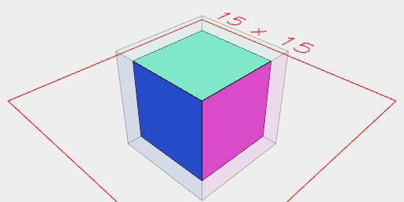
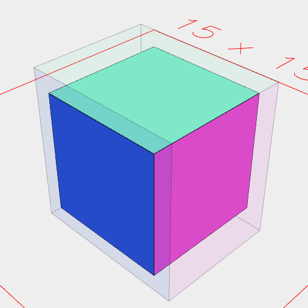
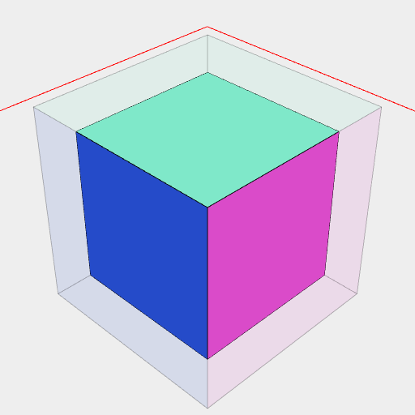
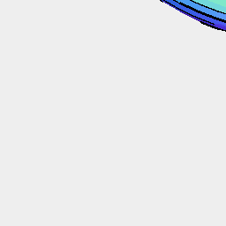
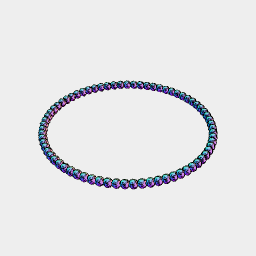
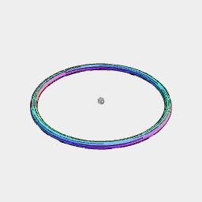

[index](../../nb/api/index.md)
### grow()
Parameter|Default|Type
---|---|---
tool||shape to grow by

Generates a shape around the input by growing it with a minkowski sum with the tool.



The box is grown by 5 mm in all directions.

```JavaScript
Box(5, 5, 5)
  .and(grow(Orb(5)).ghost())
  .view()
  .note('The box is grown by 5 mm in all directions.');
```



The box is rounded out by 5 mm in Y.

```JavaScript
Box(5, 5, 5)
  .and(grow(ArcY(5)).ghost())
  .view()
  .note('The box is rounded out by 5 mm in Y.');
```



Box(5, 5, 20).and(grow(Box(4)).ghost()) grows the box 4 mm horizontally with sharp corners.

```JavaScript
Box(5, 5, 20)
  .and(grow(Box(4)).ghost())
  .view()
  .note(
    "Box(5, 5, 20).and(grow(Box(4)).ghost()) grows the box 4 mm horizontally with sharp corners."
  );
```



Arc(20).grow(Orb(1)) thickens a disc

```JavaScript
Arc(20)
  .grow(Orb(1))
  .view()
  .note("Arc(20).grow(Orb(1)) thickens a disc");
```



Arc(20).points().grow(Orb(1)) grows the points of an circle into spheres

```JavaScript
Arc(20)
  .points()
  .grow(Orb(1))
  .view()
  .note("Arc(20).points().grow(Orb(1)) grows the points of an circle into spheres");
```



Arc(20).outline().grow(Orb(1)) grows the rim of a circle into a tube

```JavaScript
Arc(20)
  .outline()
  .grow(Orb(1))
  .view()
  .note("Arc(20).outline().grow(Orb(1)) grows the rim of a circle into a tube");
```
