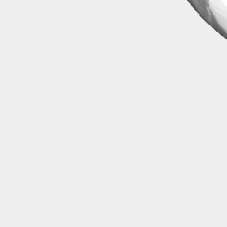
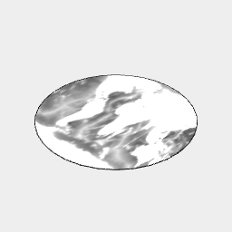

[index](../../nb/api/index.md)
### image()
Parameter|Default|Type
---|---|---
|url||Url of the image to display as a texture.

This specifies an image to use as a texture for a shape.

The texture does not affect the geometry.

See: [material](../../nb/api/material.md)



Orb(4).image('https://jsxcad.js.org/png/bathymetry.png')

```JavaScript
Orb(4, { zag: 0.1 })
  .image('https://jsxcad.js.org/png/bathymetry.png')
  .view()
  .note("Orb(4).image('https://jsxcad.js.org/png/bathymetry.png')");
```



Arc(4).image('https://jsxcad.js.org/png/bathymetry.png')

```JavaScript
Arc(4)
  .image('https://jsxcad.js.org/png/bathymetry.png')
  .view()
  .note("Arc(4).image('https://jsxcad.js.org/png/bathymetry.png')");
```
