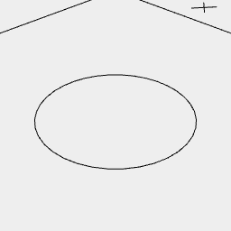
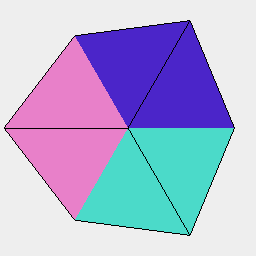

[index](../../nb/api/index.md)
### involute()
Produces a surface inscribed within the shape.

Reverses the faces of a shape.

This is occasionally useful for repairing shapes.



Arc(5).involute() produces a downward facing surface

```JavaScript
Arc(5)
  .involute()
  .view()
  .note('Arc(5).involute() produces a downward facing surface');
```



Box(5, 5, 5) produces an inside out box.

```JavaScript
Box(5, 5, 5).involute().view().note('Box(5, 5, 5) produces an inside out box.');
```
