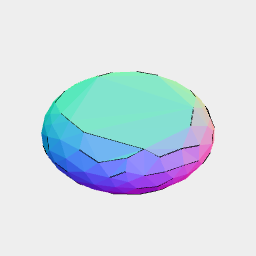

[index](../../nb/api/index.md)
### iron()
Parameter|Default|Type
---|---|---
turn|1/360|Maximum angle to iron flat.

Flattens angles under the threshold.



Orb(10, 10, 5).iron(8 / 360)

```JavaScript
Orb(10, 10, 5)
  .iron(8 / 360)
  .view()
  .note('Orb(10, 10, 5).iron(8 / 360)');
```
