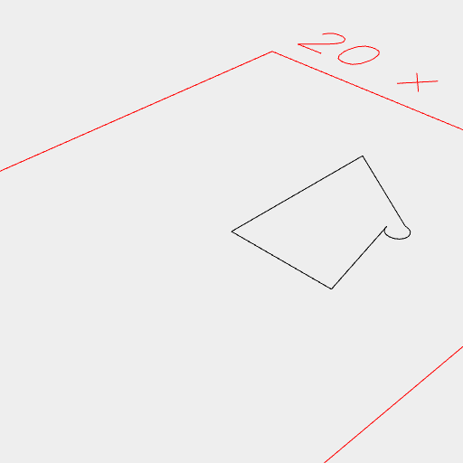

### loop(...shapes)
Parameter|Default|Type
---|---|---
|...shapes||Shapes to link into a closed polyline.

Constructs a polyline from the segments of the shape and provided shapes.

The shapes are linked by straight segments.

The polyline is closed.

See: [Loop](../../nb/api/Loop.nb), [link](#https://raw.githubusercontent.com/jsxcad/JSxCAD/master/nb/api/link.md)

_Note: We should rethink Arc and Box being implicitly filled._

```JavaScript
Line(5)
  .loop(Point(0, 8), Arc([4, 5], [4, 5]).hasAngle(0 / 4, 3 / 4))
  .view()
  .note(
    'Line(5).loop(Point(0, 8), Arc([4, 5], [4, 5]).hasAngle(0 / 4, 3 / 4))'
  );
```



Line(5).loop(Point(0, 8), Arc([4, 5], [4, 5]).hasAngle(0 / 4, 3 / 4))
