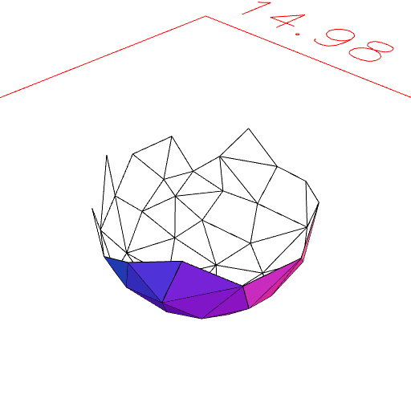

### lowerEnvelope()

Generates a shape that covers the base of the shape.

The envelope is monotonic - there is no vertical convexity.

The envelope is safe for vertical extrusion.

See: [upperEnvelope](#https://raw.githubusercontent.com/jsxcad/JSxCAD/master/nb/api/upperEnvelope.nb)

```JavaScript
Orb(5).lowerEnvelope().view().note('The lower envelope of a rough sphere.');
```



The lower envelope of a rough sphere.
