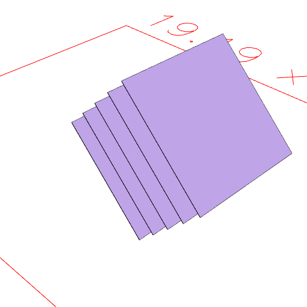

### m()
Parameter|Default|Type
---|---|---
|...distances||Distances to move in mm.

Moves a shape by distances along its normal.

See: [moveAlong](../../nb/api/m.md)

```JavaScript
Box(5)
  .ry(7 / 8)
  .and(m(1, 2, 3, 4))
  .view()
  .note(
    'Box(5).ry(7 / 8).and(m(1, 2, 3, 4)) adds the box moved along its normal by 1, 2, 3, and 4 mm.'
  );
```



Box(5).ry(7 / 8).and(m(1, 2, 3, 4)) adds the box moved along its normal by 1, 2, 3, and 4 mm.
