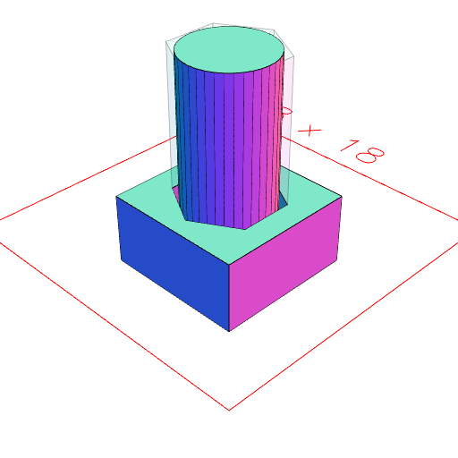

### masking()
Parameter|Default|Type
---|---|---
|other||Shape to mask.

Makes shape into a mask for the other shape.

When the result is cut away from something, shape will be removed, and other will not be involved in the operation.

This allows for things like threaded bolts with cylindrical hole fittings.

See: [mask](../../nb/api/mask.md)

```JavaScript
Hexagon(6)
  .ez(10)
  .masking(Arc(5).ez(10))
  .fit(Box(8, 8, 4))
  .view()
  .note(
    'Hexagon(6).ez(10).masking(Arc(5).ez(10)) produces a hexagonal mask for the cylindrical volume.'
  );
```



Hexagon(6).ez(10).masking(Arc(5).ez(10)) produces a hexagonal mask for the cylindrical volume.
