### material()
Parameter|Default|Type
---|---|---
materal||Name of the material to use.

Supported materials:
* aluminium
* brass
* brick
* cardboard
* circuit
* copper
* glass
* grass
* leaves
* metal
* paper
* plastic
* rock
* steel
* transparent
* water
* wood
* wet-glass
* zinc-steel

See: [image](../../nb/api/image.md)

```JavaScript
Box(5, 5, 2).material('aluminium').view().note("material('aluminium')");
```


material('aluminium')

```JavaScript
Box(5, 5, 2).material('brass').view().note("material('brass')");
```

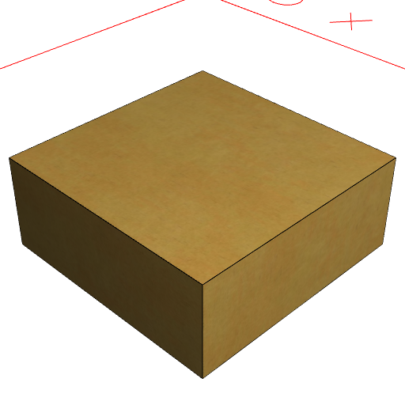

material('brass')

```JavaScript
Box(5, 5, 2).material('brick').view().note("material('brick')");
```

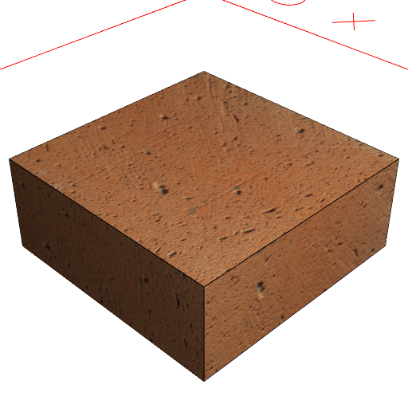

material('brick')

```JavaScript
Box(5, 5, 2).material('cardboard').view().note("material('cardboard')");
```

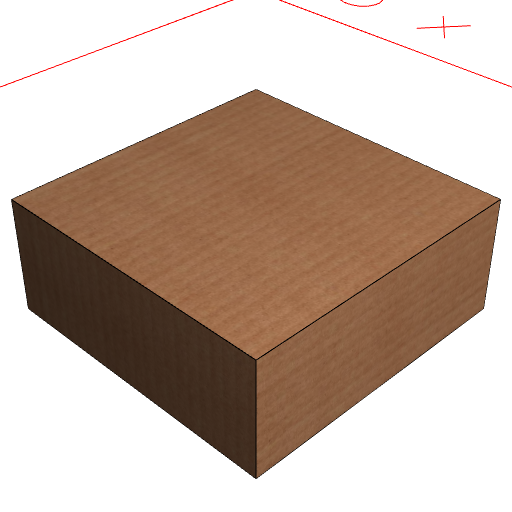

material('cardboard')

```JavaScript
Box(5, 5, 2).material('circuit').view().note("material('circuit')");
```

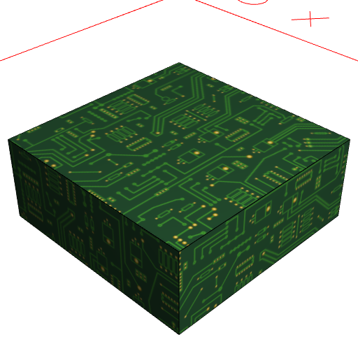

material('circuit')

```JavaScript
Box(5, 5, 2).material('copper').view().note("material('copper')");
```


material('copper')

```JavaScript
Box(5, 5, 2).material('glass').view().note("material('glass')");
```

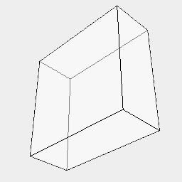

material('glass')

```JavaScript
Box(5, 5, 2).material('grass').view().note("material('grass')");
```

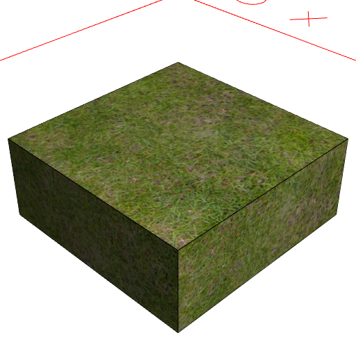

material('grass')

```JavaScript
Box(5, 5, 2).material('leaves').view().note("material('leaves')");
```

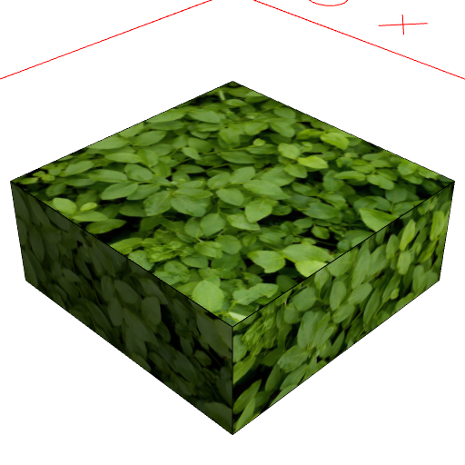

material('leaves')

```JavaScript
Box(5, 5, 2).material('metal').view().note("material('metal')");
```


material('metal')

```JavaScript
Box(5, 5, 2).material('paper').view().note("material('paper')");
```

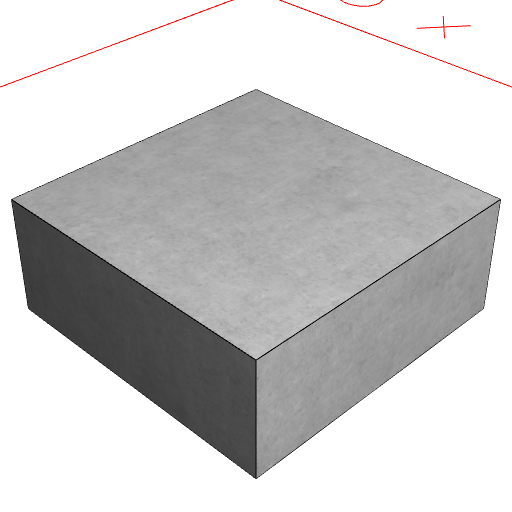

material('paper')

```JavaScript
Box(5, 5, 2).material('plastic').view().note("material('plastic')");
```

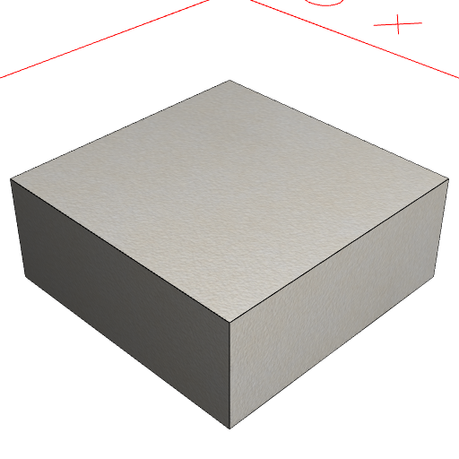

material('plastic')

```JavaScript
Box(5, 5, 2).material('rock').view().note("material('rock')");
```

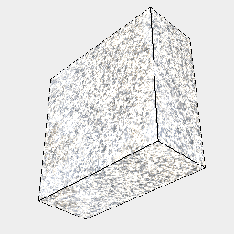

material('rock')

```JavaScript
Box(5, 5, 2).material('steel').view().note("material('steel')");
```

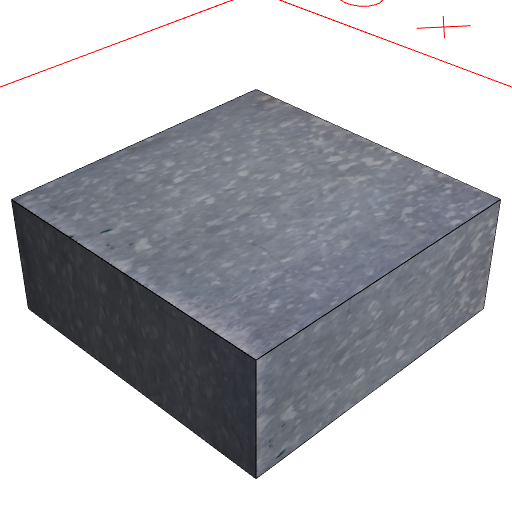

material('steel')

```JavaScript
Box(5, 5, 2).material('transparent').view().note("material('transparent')");
```


material('transparent')

```JavaScript
Box(5, 5, 2).material('water').view().note("material('water')");
```

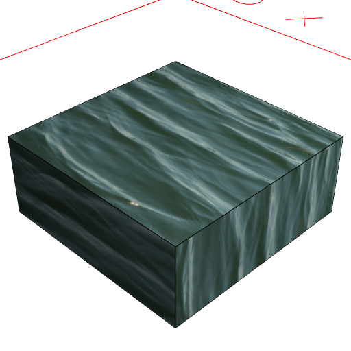

material('water')

```JavaScript
Box(5, 5, 2).material('wood').view().note("material('wood')");
```

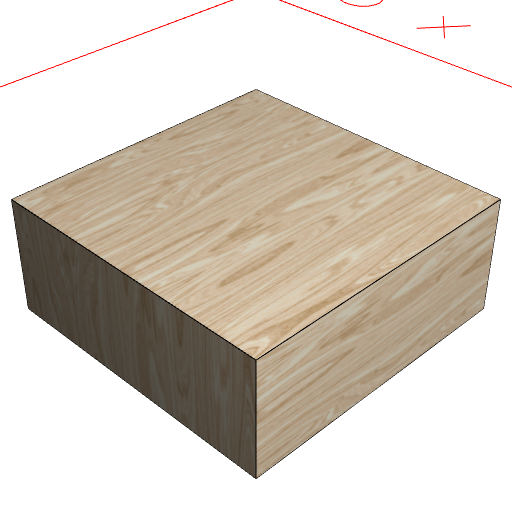

material('wood')

```JavaScript
Box(5, 5, 2).material('wet-glass').view().note("material('wet-glass')");
```


material('wet-glass')

```JavaScript
Box(5, 5, 2).material('zinc-steel').view().note("material('zinc-steel')");
```

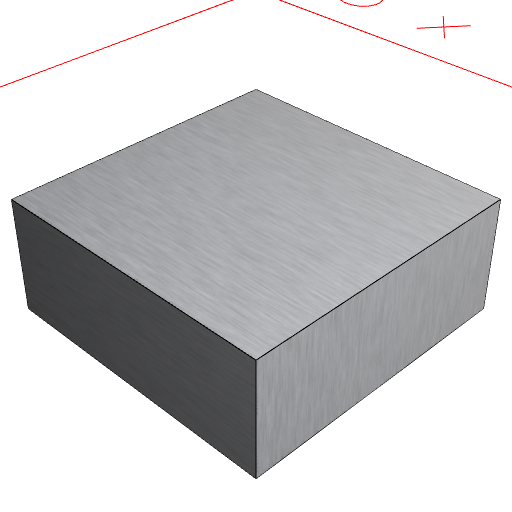

material('zinc-steel')
