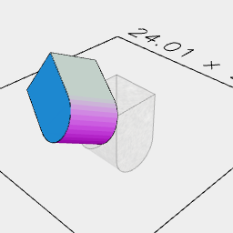
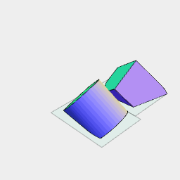

[index](../../nb/api/index.md)
### minimizeOverhang()
Parameter|Default|Type
---|---|---
|threshold|130|Reference shape

Arranges a shape so that when cut along the XY(0) plane it produces two shapes with the area of faces with inclinations exceeding the threshold projected onto the XY(0) plane being semi-minimal.

The result can then be cut and reoriented using something like cutOut(XY(), rx(0), rx(1 / 2)).

Note: This is experimental and may change.



ArcX(5, 5, [-5]).join(Box(5, 5, 5)).minimizeOverhang()

```JavaScript
ArcX(5, 5, [-5]).join(Box(5, 5, 5)).minimizeOverhang().view()
  .note('ArcX(5, 5, [-5]).join(Box(5, 5, 5)).minimizeOverhang()');
```



ArcX(5, 5, [-5]).join(Box(5, 5, 5)).minimizeOverhang().cutOut(XY(), rx(0), rx(1 / 2)).pack()

```JavaScript
ArcX(5, 5, [-5]).join(Box(5, 5, 5)).minimizeOverhang().cutOut(XY(), rx(0), rx(1 / 2)).pack().view()
  .note('ArcX(5, 5, [-5]).join(Box(5, 5, 5)).minimizeOverhang().cutOut(XY(), rx(0), rx(1 / 2)).pack()');
```
