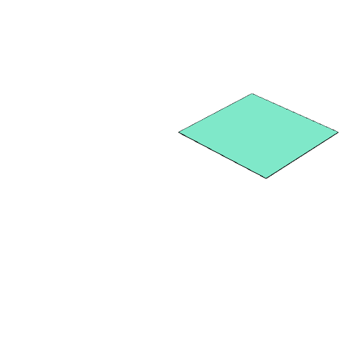
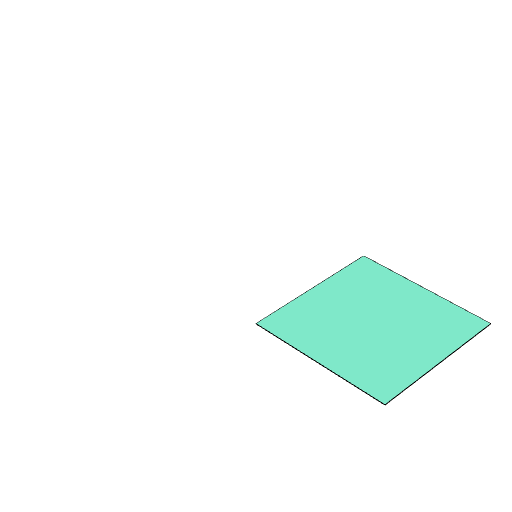

### move()
Parameter|Default|Type
---|---|---
offset||Coordinate giving [x, y, z] offset.

Moves a shape by the offset given.

See: [moveAlong](#https://raw.githubusercontent.com/jsxcad/JSxCAD/master/nb/api/moveAlong.nb)

```JavaScript
Box().move(0, 1, 0).view().note('Box().move(0, 1, 0) moves one along y.');
```



Box().move(0, 1, 0) moves one along y.

```JavaScript
Box()
  .move(Point(1, 0, 0))
  .view()
  .note('Box().move(Point(1, 0, 0)) moves one along x');
```



Box().move(Point(1, 0, 0)) moves one along x
