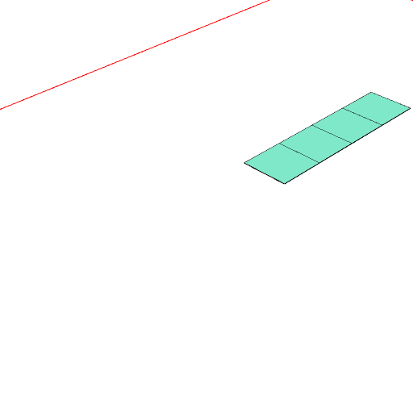
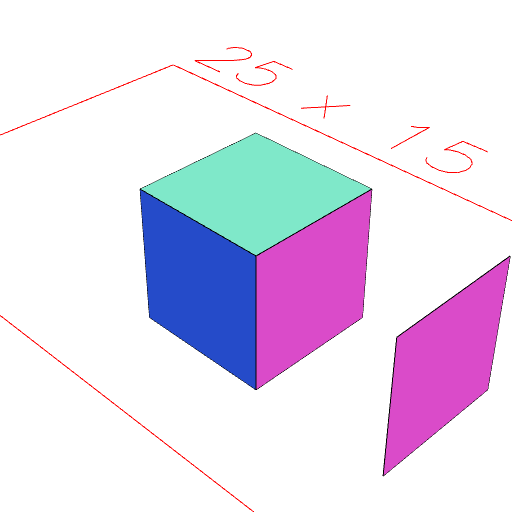

### moveAlong()
Parameter|Default|Type
---|---|---
|direction|_required_|Reference shape.
|...distances||Distances to move in mm.

See: [m](../../nb/api/m.md)

```JavaScript
Box()
  .moveAlong(Point(0, 1), 2, 3, 4, 5)
  .view()
  .note(
    'Box().moveAlong(Point(0, 1), 2, 3, 4, 5) moves the box by 2, 3, 4, and 5 respectively toward y+.'
  );
```



Box().moveAlong(Point(0, 1), 2, 3, 4, 5) moves the box by 2, 3, 4, and 5 respectively toward y+.

```JavaScript
Box(5, 5, 5)
  .and(faces().n(2).moveAlong(normal(), 5))
  .view()
  .note(
    'Box(5, 5, 5).and(faces().n(2).moveAlong(normal(), 5)) copies one face of a box and moves it 5 along its normal.'
  );
```



Box(5, 5, 5).and(faces().n(2).moveAlong(normal(), 5)) copies one face of a box and moves it 5 along its normal.
